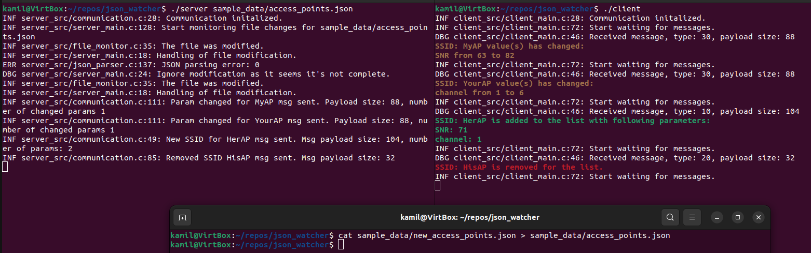

# json_watcher_c

Requires CZMQ library with headers, e.g. on Ubuntu: `sudo apt install libczmq4 libczmq-dev`

Build with `make all` in this folder.
It will create two executables: server and client.

Usage and sample output:

